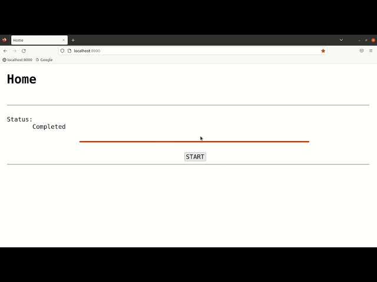

# CeleryIndeterminateProgressbar  
This project is updating an indeterminate progress bar to show the progress of a background running task whose progress cannot be determined.  
The background running task is simulating a high computational task. This task is made to run in background by using Celery.  
  
Following is the execution flow of this project:  
1. Click on the "START" button
2. This will connect the front-end (i.e., javascript) with a web-socket (Django at backend)
3. This web-socket code (Django at backend) will accept the connection request and initiate a Celery task (in Python), i.e., in background
4. This web-socket (Django at backend) will send a signal to the front-end (i.e., javascript) that the background task has started. The front-end (i.e., javascript) script will update the same on the interface by showing status as "Started" and start the indeterminate progress bar  
  
Following are the technologies used to develop this project:  
1. HTML / CSS
2. JavaScript / jQuery
3. Django
4. Celery
5. WebSocket
  
## Demo Video  
Please click on the below YouTube thumbnail to play the demo video:  
[](https://youtu.be/MHIyf5vv1r8 "CeleryIndeterminateProgressbar Demo")  
  
## Steps to build and run this project  
Following are the steps to build and run this project:  
1. Make a Django project:  
`$ django-admin startproject CeleryIndeterminateProgressbar`  
2. Change the directory to the project directory and run the following commands:  
`$ cd CeleryIndeterminateProgressbar`  
`$ python manage.py migrate`  
`$ python manage.py runserver`  
Open a browser and hit "localhost:8000", you should see the default Django server page  
3. Create a file "CeleryIndeterminateProgressbar/celery.py" and paste the following code in it:  
```commandline
# packages
import os
from celery import Celery

# set default environment
os.environ.setdefault('DJANGO_SETTINGS_MODULE', 'CeleryIndeterminateProgressbar.settings')
# create celery instance with a name
app = Celery('CeleryIndeterminateProgressbar')
# celery configurations
app.config_from_object('django.conf:settings', namespace="CELERY")
# celery - discover tasks
app.autodiscover_tasks()
```  
4. Create an app, HomeApp, by running the following command:  
`$ python manage.py startapp HomeApp`  
5. Create the following directories:  
   1. "HomeApp/templates/"   
   2. "HomeApp/static/"  
6. Create a file "HomeApp/templates/home.html" and paste the following code in it:  
```commandline
<!DOCTYPE html>
<html>
    <head>
        
        <link rel="stylesheet" href="">
        <script type="text/javascript" src=""></script>
        <script src="https://ajax.googleapis.com/ajax/libs/jquery/3.6.1/jquery.min.js"></script>
        <title>Home</title>
    </head>
    <body>
        <h1>Home</h1>
        <br><hr><br>
        Status:
        <div id="status">
            Not Started
        </div>
        <br>
        <progress id="progress_bar" value="0" max="100"></progress>
        <br><br>
        <button type="button" id="button_startEvent" name="button_startEvent" onclick="startEvent()">START</button>
        <br><hr>
    </body>
</html>
```  
7. Create a file "HomeApp/static/home.css" and paste the following code in it:  
```commandline
body {
    margin-left: 30px;
    margin-right: 30px;
    font-family: monospace, monospace;
    font-size: 24px;
}

h1 {
    font-family: monospace, monospace;
}

#status {
    margin-left: 100px;
}

#progress_bar {
    margin-left: 20%;
    width: 900px;
    font-family: monospace, monospace;
    font-size: 24px;
}

#button_startEvent {
    margin-left: 49%;
    font-family: monospace, monospace;
    font-size: 24px;
}
```  
8. Paste the following code at the bottom of the file "CeleryIndeterminateProgressbar/settings.py":  
```commandline
#################################################################################
# CELERY SETTINGS
#################################################################################
CELERY_BROKER_URL = 'amqp://localhost'
CELERY_RESULT_BACKEND = 'rpc://localhost'
```  
This is for Celery.  
9. In "CeleryIndeterminateProgressbar/settings.py", copy the following line:  
`WSGI_APPLICATION = 'CeleryIndeterminateProgressbar.wsgi.application'`  
In the above line, change "wsgi" to "asgi". After this change, the new line will look like:  
`ASGI_APPLICATION = 'CeleryIndeterminateProgressbar.asgi.application'`  
Paste the new line ("asgi" line) just below the "wsgi" line. After this operation, it will look like:  
```commandline
WSGI_APPLICATION = 'CeleryIndeterminateProgressbar.wsgi.application'
ASGI_APPLICATION = 'CeleryIndeterminateProgressbar.asgi.application'
```  
Thie above lines will help in WebSocket communication.  
10. In "CeleryIndeterminateProgressbar/urls.py" file, paste the below code:  
```commandline
from django.contrib import admin
from django.urls import path, include

urlpatterns = [
    path('admin/', admin.site.urls),
    path("", include("HomeApp.urls")),
]
```  
11. Open "CeleryIndeterminateProgressbar/asgi.py" and paste the following code:  
```commandline
"""
ASGI config for realtime_pr project.

It exposes the ASGI callable as a module-level variable named ``application``.

For more information on this file, see
https://docs.djangoproject.com/en/4.0/howto/deployment/asgi/
"""

import os
from django.core.asgi import get_asgi_application
#websocket packages
from channels.routing import ProtocolTypeRouter
from channels.auth import AuthMiddlewareStack
from channels.routing import URLRouter
from HomeApp.routing import ws_urlpatterns

os.environ.setdefault('DJANGO_SETTINGS_MODULE', 'CeleryIndeterminateProgressbar.settings')

application = ProtocolTypeRouter({
    'http': get_asgi_application(),
    'websocket': AuthMiddlewareStack(URLRouter(ws_urlpatterns)),
})
```  
The above code will help in WebSocket communication.  
12. Create "HomeApp/static/home.js" and paste the following code:  
```commandline
function startEvent() {
    // get the current status
    var current_status = $("#status").text();
    // create websocket connection
    var socket = new WebSocket("ws://localhost:8000/ws/some_url/");
    // trigger on on_message event
    socket.onmessage = function(event) {
        var data = JSON.parse(event.data);
        if(data.message != current_status) {
            $("#status").html(data.message);
        }
        if(data.message == "Started") {
            var progress_bar = document.getElementById("progress_bar");
            progress_bar.removeAttribute("value");
        }
        if(data.message == "Completed") {
            $("#progress_bar").val("100");
        }
    }
}
```  
13. Open "HomeApp/views.py" and paste the following code:  
```commandline
# packages
from django.shortcuts import render

# home view for home.html page
def homeView(request):
    return render(request, "home.html")
```  
14. Create "HomeApp/urls.py" and paste the following code:  
```commandline
# packages
from django.urls import path
from .views import homeView

urlpatterns = [
    path("", homeView, name="home page"),
]
```  
15. Create "HomeApp/routing.py" file and paste the following code:  
```commandline
from django.urls import path
from .consumers import WSConsumer

ws_urlpatterns = [
    path('ws/some_url/', WSConsumer.as_asgi())
]
```  
16. Create "HomeApp/tasks.py" file and paste the following code:  
```commandline
# packages
from CeleryIndeterminateProgressbar.celery import app
from random import randint
import time

@app.task(bind=True)
def gen_random(self):
    # generate a random number
    r = randint(10, 20)
    # sleep for r seconds
    time.sleep(r)
    return 1
```  
17. Create "HomeApp/consumers.py" file and paste the following code:  
```commandline
from channels.generic.websocket import WebsocketConsumer
import json
import time
from .tasks import gen_random

class WSConsumer(WebsocketConsumer):
    # connect function
    def connect(self):
        # accept the connection
        self.accept()
        # get object of the celery task
        task = gen_random.delay()
        # sleep for 1 second, let that background task start
        time.sleep(1)
        # keep checking until the background task completes successfully
        while(task.ready() != True and task.state != "SUCCESS"):
            # prepare the JSON response for the front-end
            message_dict = {
                'message': "Started",
            }
            json_message = json.dumps(message_dict)
            # send the response
            self.send(json_message)
            # wait for 1 second and check again
            time.sleep(1)
        # on successful completion, prepare the JSON response
        message_dict = {
            'message': "Completed",
        }
        json_message = json.dumps(message_dict)
        # send the response
        self.send(json_message)
        return 1
```  
18. Run the following command in one terminal:  
`$ celery -A CeleryIndeterminateProgressbar worker -l info`  
And the following command in another terminal:  
`$ python manage.py runserver`  
Open a browser and hit "localhost:8000", the app should work there as shown in the demo video above.  
19. Following are some points to take care of:
    1. The name of Celery tasks file must be "tasks.py"
    2. Install "channels" Python package. It is required for WebSocket communication. Its version must be "3.0.4" for Django version ">=4.0.0"
    3. When every you make any changes related to Celery, such as "HomeApp/tasks.py", etc., then re-run the `$ celery -A CeleryIndeterminateProgressbar worker -l info` command.  
  
