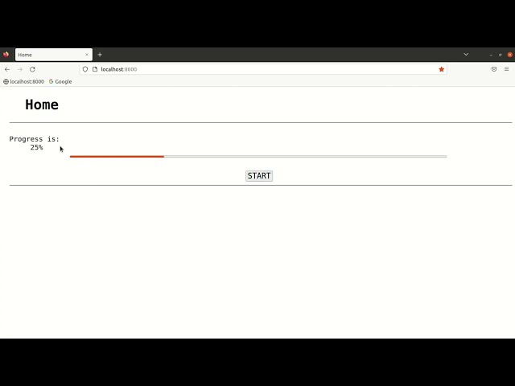

# CeleryProgressbar  
This project is updating a progress bar to show the progress of a background running task.  
The background running task is simulating a high computational task. This task is made to run in background by using Celery.  
  
Following is the execution flow of this project:  
1. Click on the "START" button
2. This will connect the front-end (i.e., javascript) with a web-socket (Django at backend)
3. This web-socket code (Django at backend) will accept the connection request and initiate a Celery task (in Python), i.e., in background
4. This web-socket (Django at backend) will get the progress made by the Celery task (Python code) and send it to the connected front-end (javascript)
5. The front-end (javascript) will update the progress-bar and its value (i.e., HTML page)  
  
Following are the technologies used to develop this project:  
1. HTML / CSS
2. JavaScript / jQuery
3. Django
4. Celery
5. WebSocket
  
## Demo Video  
Please click on the below YouTube thumbnail to play the demo video:  
[](https://youtu.be/YIprFOy32QA "CeleryProgressbar Demo")  
  
## Steps to build and run this project  
Following are the steps to build and run this project:  
1. Make a Django project:  
`$ django-admin startproject CeleryProgressbar`  
2. Change the directory to the project directory and run the following commands:  
`$ cd CeleryProgressbar`  
`$ python manage.py migrate`  
`$ python manage.py runserver`  
Open a browser and hit "localhost:8000", you should see the default Django server page  
3. Create an app, HomeApp, by running the following command:  
`$ python manage.py startapp HomeApp`  
4. Create the following directories:  
   1. "HomeApp/templates/"   
   2. "HomeApp/static/"  
5. Create a file "HomeApp/templates/home.html" and paste the following code in it:  
```commandline
<!DOCTYPE html>
<html>
    <head>
        
        <link rel="stylesheet" href="">
        <script src="https://ajax.googleapis.com/ajax/libs/jquery/3.6.1/jquery.min.js"></script>
        <script type="text/javascript" src=""></script>
        <title>Home</title>
    </head>
    <body>
        <h1>Home</h1>
        <hr><br>
        Progress is:
        <div id="div_progress_val">
            0%
        </div>
        <progress id="progress_bar" value="0" max="100"></progress>
        <br><br>
        <button type="button" name="button_startAction" id="button_startAction" onclick="startAction()">START</button>
        <br><hr>
    </body>
</html>
```  
6. Create a file "HomeApp/static/home.css" and paste the following code in it:  
```commandline
body {
    margin-left: 30px;
    font-family: monospace, monopsace;
    font-size: 20px;
}

h1 {
    margin-left: 45px;
    font-family: monospace, monospace;
}

#div_progress_val {
    margin-left: 60px;
    font-family: monospace, monospace;
    font-size: 20px;
}

#progress_bar {
    margin-left: 12%;
    width: 75%;
    height: 30px;
}

#button_startAction {
    margin-left: 47%;
    font-family: monospace, monospace;
    font-size: 22px;
}
```  
7. Paste the following code at the bottom of the file "CeleryProgressbar/settings.py":  
```commandline
#################################################################################
# CELERY SETTINGS
#################################################################################
CELERY_BROKER_URL = 'amqp://localhost'
CELERY_RESULT_BACKEND = 'rpc://localhost'
```  
This is for Celery.  
8. In "CeleryProgressbar/settings.py", copy the following line:  
`WSGI_APPLICATION = 'CeleryProgressbar.wsgi.application'`  
In the above line, change "wsgi" to "asgi". After this change, the new line will look like:  
`ASGI_APPLICATION = 'CeleryProgressbar.asgi.application'`  
Paste the new line ("asgi" line) just below the "wsgi" line. After this operation, it will look like:  
```commandline
WSGI_APPLICATION = 'CeleryProgressbar.wsgi.application'
ASGI_APPLICATION = 'CeleryProgressbar.asgi.application'
```  
Thie above lines will help in WebSocket communication.  
9. In "CeleryProgressbar/urls.py" file, paste the below code:  
```commandline
from django.contrib import admin
from django.urls import path, include

urlpatterns = [
    path('admin/', admin.site.urls),
    path("", include("HomeApp.urls")),
]
```  
10. Open "HomeApp/asgi.py" and paste the following code:  
```commandline
"""
ASGI config for realtime_pr project.

It exposes the ASGI callable as a module-level variable named ``application``.

For more information on this file, see
https://docs.djangoproject.com/en/4.0/howto/deployment/asgi/
"""

import os
from django.core.asgi import get_asgi_application
#websocket packages
from channels.routing import ProtocolTypeRouter
from channels.auth import AuthMiddlewareStack
from channels.routing import URLRouter
from HomeApp.routing import ws_urlpatterns

os.environ.setdefault('DJANGO_SETTINGS_MODULE', 'SimpleWebsocket.settings')

application = ProtocolTypeRouter({
    'http': get_asgi_application(),
    'websocket': AuthMiddlewareStack(URLRouter(ws_urlpatterns)),
})
```  
The above code will help in WebSocket communication.  
11. Create "HomeApp/static/home.js" and paste the following code:  
```commandline
// function to execute on click of "button_startAction"
function startAction() {
    // reset the value of progress division
    $("#div_progress_val").html("0%");
    // reset the value of progress bar
    $("#progress_bar").val("0");
    // create websocket connection
    var socket = new WebSocket("ws://localhost:8000/ws/some_url/");
    socket.onmessage = function(event) {
        var data = JSON.parse(event.data);
        if(parseInt(data.message) > -1) {
            $("#div_progress_val").html(data.message + "%");
            $("#progress_bar").val(data.message);
        }
    }
}
```  
12. Open "HomeApp/views.py" and paste the following code:  
```commandline
# packages
from django.shortcuts import render

# home view for home.html page
def homeView(request):
    return render(request, "home.html")
```  
13. Create "HomeApp/urls.py" and paste the following code:  
```commandline
# packages
from django.urls import path
from .views import homeView

urlpatterns = [
    path("", homeView, name="home page"),
]
```  
14. Create "HomeApp/routing.py" file and paste the following code:  
```commandline
from django.urls import path
from .consumers import WSConsumer

ws_urlpatterns = [
    path('ws/some_url/', WSConsumer.as_asgi())
]
```  
15. Create "HomeApp/tasks.py" file and paste the following code:  
```commandline
# packages
from CeleryProgressbar.celery import app
from random import randint
import time

@app.task(bind=True)
def gen_random(self):
    total_progress = 0
    # initial result or progress
    dict_result = {
        'result': -1
    }
    # send the initial result or progress
    self.update_state(state="PROGRESS", meta=dict_result)
    # run the while loop - simulating the processing
    while(total_progress < 100):
        # generate a random number or progress
        r = randint(3, 10)
        # calculate the total progress
        if((total_progress + r) > 100):
            r = 100 - total_progress
        total_progress += r
        # update the progress on the terminal
        print(">>>>>>>>>>> " + str(r) + " -- " + str(total_progress))
        # make result dictionary
        dict_result = {
            'result': total_progress
        }
        # sleep the process before sending the result
        time.sleep(r)
        # send the update
        self.update_state(state="PROGRESS", meta=dict_result)
    # wait for smooth finish
    time.sleep(3)
    return 1
```  
16. Create "HomeApp/consumers.py" file and paste the following code:  
```commandline
from channels.generic.websocket import WebsocketConsumer
import json
import time
from .tasks import gen_random

class WSConsumer(WebsocketConsumer):
    # connect function
    def connect(self):
        # accept the connection
        self.accept()
        # get object of the celery task
        task = gen_random.delay()
        time.sleep(1)
        while(task.ready() != True and task.state != "SUCCESS"):
            message_dict = {
                'message': task.result['result'],
            }
            json_message = json.dumps(message_dict)
            self.send(json_message)
            time.sleep(1)
```  
17. Run the following command in one terminal:  
`$ celery -A CeleryProgressbar worker -l info`  
And the following command in another terminal:  
`$ python manage.py runserver`  
Open a browser and hit "localhost:8000", the app should work there as shown in the demo video above.  
18. Following are some points to take care of:
    1. The name of Celery tasks file must be "tasks.py"
    2. Install "channels" Python package. It is required for WebSocket communication. Its version must be "3.0.4" for Django version ">=4.0.0"
    3. When every you make any changes related to Celery, such as "HomeApp/tasks.py", etc., then re-run the `$ celery -A CeleryProgressbar worker -l info` command.  
  
## Role of Celery  
## Role of RPC  
## Role of WebSocket  