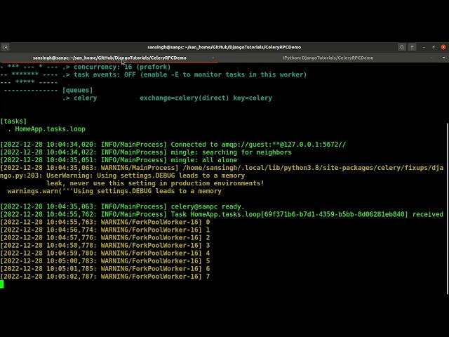

# CeleryRPCDemo  
This is a sample Celery/Django project.  
  
In this project, we will learn to offload the time-consuming tasks to an asynchronous process which will not hinder the responsiveness of the web application so that user don't feel like stuck. Along with this, we will keep checking the status of the offloaded task in this project.  
  
Following technologies are the key focus in this project:  
1. Django
2. Celery
3. RPC  
4. HTML/CSS
5. Javascript / jQuery / AJAX  
  
## Demo Video  
[](https://youtu.be/gwYAosHHRUs "CeleryRPC Demo")  
  
## Steps to build and run this project  
Following are the steps to run this project:  
1. First of all, start the rabbitmq-server by firing the following command:  
`$ sudo systemctl start rabbitmq-server`  
Check the status of server:  
`$ sudo systemctl status rabbitmq-server`  
Press ctrl+C to exit the running server
2. Create a django project:  
`$ django-admin startproject CeleryRPCDemo`  
3. Enter inside the project and run the following commands:  
```commandline
$ python manage.py migrate  
$ python manage.py runserver  # to test the working of Django server
```  
4. Create a new app:  
`$ python manage.py startapp HomeApp`  
5. Add the name of app "HomeApp" in the settings.py file of this project:  
`$ vim CeleryRPCDemo/settings.py`  
Add the following lines at the bottom of this file:  
```commandline
# CELERY SETTINGS
CELERY_BROKER_URL = 'amqp://localhost'
CELERY_RESULT_BACKEND = 'rpc://localhost'
```  
6. Create "celery.py" file in "CeleryRPCDemo" directory:  
```commandline
import os
from celery import Celery
# Set the default Django settings module for the 'celery' program.
os.environ.setdefault('DJANGO_SETTINGS_MODULE', 'CeleryRPCDemo.settings')

app = Celery('CeleryRPCDemo')

# Using a string here means the worker doesn't have to serialize
# the configuration object to child processes.
# - namespace='CELERY' means all celery-related configuration keys
#   should have a `CELERY_` prefix.
app.config_from_object('django.conf:settings', namespace='CELERY')

# Load task modules from all registered Django apps.
app.autodiscover_tasks()
```  
7. Create "tasks.py" file in "HomeApp" directory:  
```commandline
import time
from celery import shared_task
from CeleryRPCDemo.celery import app

@app.task(bind=True)
def loop(self, l):
    "simulate a long-running task like export of data or generateing a report"
    for i in range(int(l)):
        print(i)
        time.sleep(1)
        self.update_state(state='PROGRESS',
                          meta={'current': i, 'total': l})
    print('Task completed')
    return {'current': 100, 'total': 100, }
```  
8. Run the command from the project root directory "/CeleryRPCDemo/":  
`$ celery -A CeleryRPCDemo worker -l info`  
9. In another tab (at the same path), copy the code in file "/CeleryRPCDemo/test.py" and paste after starting the python shell by the following command:  
`$ python manage.py shell`  
After pasting the code copied from the file "/CeleryRPCDemo/test.py", you can see the output on both the terminal - python shell and celery worker terminal  