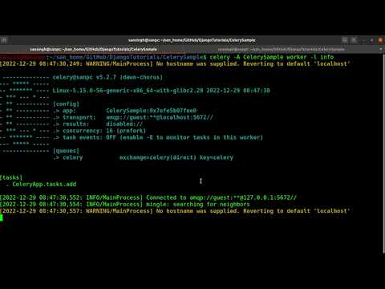

# CelerySample  
This is a sample Celery/Django project.  
  
In this project, we will learn to offload the time-consuming tasks to an asynchronous process which will not hinder the responsiveness of the web application so that user don't feel like stuck.  
  
Following technologies have been used in this project:  
1. Django
2. CSS
3. JavaScript / AJAX / jQuery
4. Celery [KEY ROLE]
5. RabbitMQ [KEY ROLE]  
  
## Demo Video  
Please click on the below YouTube thumbnail to watch the demo video of this project:  
  
  
## How to run?  
Following are the steps to run this project:  
1. Open a terminal, navigate to the project directory "CelerySample" and run the following command:  
        `$ sudo systemctl start rabbitmq-server`  
        `$ sudo systemctl status rabbitmq-server`  
    Press ctrl+C to come out of the status and run the following command:  
        `$ celery -A CelerySample worker -l info`  
    By executing the above commands, we have started the rabbitmq-server, checked its status, and at last we have run the Celery worker which is connecting with the rabbitmq-server and running the offloaded task.  
2. Open another tab of terminal and run the following command:
        `$ python manage.py shell`  
        `>> from CeleryApp.tasks import add`  
        `>> add.delay(4, 8)`  
    Check the terminal in which we ran our Celery worker, there you should be able to find the result.  
  
## Steps to build Celery project  
Following are the files edited / created to develop this Celery based project:  
1. `CelerySample/celery.py`  
2. `CelerySample/urls.py`  
3. `CelerySample/settings.py`  
4. `CeleryApp/tasks.py`  
  
## Celery  
Celery is a distributed task queue.  
It allows you to offload work from your Python app. Once you integrate Celery into you Django app, you can send time-intensive tasks to Celery's task queue. That way, your web app can continue to respond quickly to users while Celery completes expensive operations asynchronously in the background.  
  
Celery is an open-source task queue that can collect, record, schedule, and perform tasks outside of your main program.  
  
Celery uses message brokers for the communication between Celery processes and the main process. Some of the supported message brokers are RabbitMQ, Redis, etc.  
  
We will be using RabbitMQ as it the best among all supported message brokers and also quite production friendly.  
  
## RabbitMQ  
RabbitMQ is a message queueing software, also known as message broker.  
  
Simply said, it is a software where queues are defined to which applications (or different processes) can connect in order to transfer a message(s).  
  
A message can be any kind of information.  
