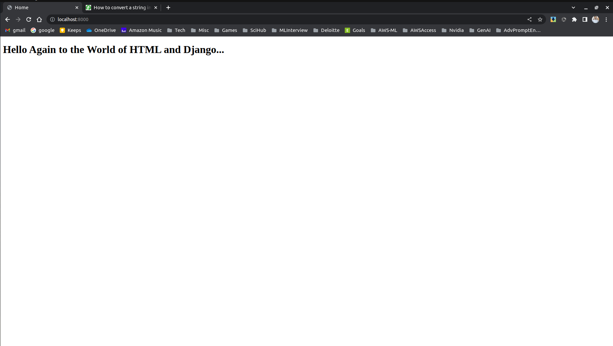
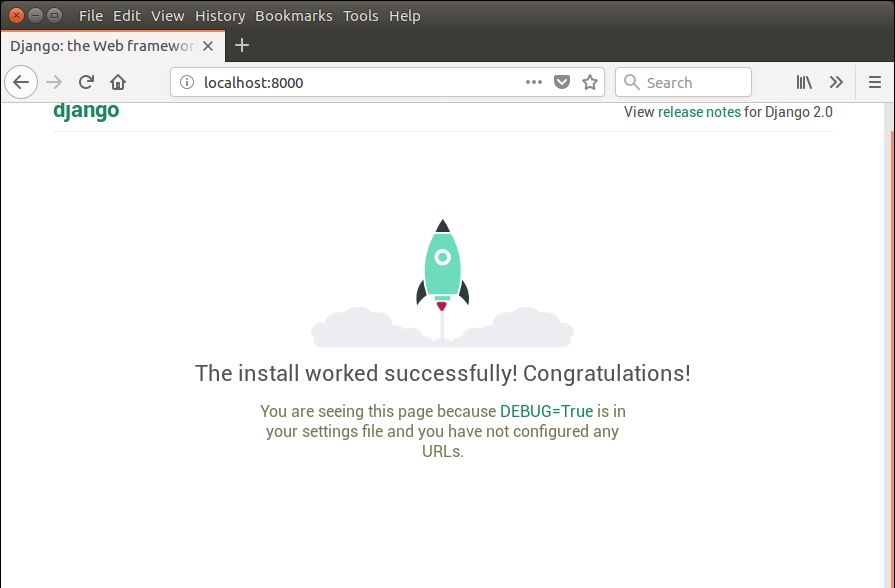

# HelloWorld  
## Introduction  
This is a simple Django project.  
This project has a single HTML page showing "Hello World".  
Following is the final output of this Django project:  
  
  
## Code  
Following are the steps to create this project:  
1. Run the following command to create a Django project:  
```
$ django-admin startproject HelloWorld
$ cd HelloWorld
$ python manage.py makemigrations
$ python manage.py migrate
$ python manage.py runserver
```  
On running the `runserver` command given above, hit `localhost:8000` in your browser, you should see something like this:  
  
  
2. Now, create an app "HomeApp":    
```commandline
$ python manage.py startapp HomeApp
```  
  
3. Specify the name of app in the `./HelloWorld/settings.py` file:  
```commandline
       :
       :
# Application definition

INSTALLED_APPS = [
    'django.contrib.admin',
    'django.contrib.auth',
    'django.contrib.contenttypes',
    'django.contrib.sessions',
    'django.contrib.messages',
    'django.contrib.staticfiles',
    'HomeApp',
]
        :
        :
```  
  
Specify the path of `HomeApp.urls.py` in `./HelloWorld/urls.py` file:  
```commandline
from django.contrib import admin
from django.urls import path, include

urlpatterns = [
    path('admin/', admin.site.urls),
    path("", include("HomeApp.urls")),
]
```  
  
4. Now, create a directory `./HomeApp/templates` and then create a file `./HomeApp/templates/home.py` file:  
```commandline
<!DOCTYPE html>
<html lang="en">
    <head>
        <title>Home</title>
    </head>
    <body>
        <h1>Hello Again to the World of HTML and Django...</h1>
    </body>
</html>
```  
  
5. Now, create a function in `./HomeApp/view.py` file:  
```commandline
from django.shortcuts import render

# Create your views here.
def homeView(request):
    return render(request, "home.html")
```  
  
6. Now, create a file `./HomeApp/urls.py` and paste the following content in it:  
```commandline
# packages
from django.urls import path
from .views import homeView

urlpatterns = [
    path("", homeView, name="home_page"),
]
```  
  
7. Now, run the following command from the root directory of the project, i.e., `~/HelloWorld`:   
```commandline
$ python manage.py migrate
$ python manage.py runserver
```  
  
Now, hit `localhost:8000` in your browser, you should see something like this:  
  
  
