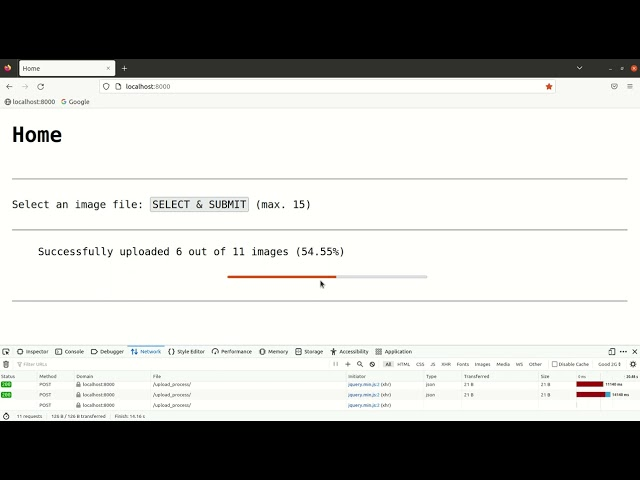

# ImageUpload  
This project is demonstrating the upload of image files. The progress of upload is shown by a progress bar.  
  
Following are the technologies used in this project:  
1. HTML / CSS  
2. JavaScript / jQuery / AJAX  
3. Django  
  
## Demo Video  
[](https://youtu.be/bTREjQEid9g "ImageUpload Demo")  
  
## Steps to Build & Run  
Following are the steps to build and run this project:  
1. Create a Django project and check the basic functionality of the default Django server by running the following command:  
```commandline
$ django-admin startproject ImageUpload  
$ cd ImageUpload  
$ python manage.py migrate  
$ python manage.py runserver  
```  
2. Create an app in this project:  
`$ python manage.py startapp HomeApp`  
3. Make configurations for this project:  
   1. Open "ImageUpload/settings.py" and make following edits:  
    ```commandline
    INSTALLED_APPS = [
        'django.contrib.admin',
        'django.contrib.auth',
        'django.contrib.contenttypes',
        'django.contrib.sessions',
        'django.contrib.messages',
        'django.contrib.staticfiles',
        'HomeApp',
    ]
    ```  
   2. Open "ImageUpload/urls.py" and make the following edits:  
    ```commandline
    urlpatterns = [
        path('admin/', admin.site.urls),
        path("", include("HomeApp.urls")),
    ]
    ```  
4. Create the following directories:  
```commandline
$ mkdir HomeApp/templates  
$ mkdir HomeApp/static  
$ mkdir HomeApp/received_data  
```  
5. Create "HomeApp/templates/home.html" and paste the following code in it:  
```commandline
<!DOCTYPE html>
<html>
    <head>
        
        <link rel="Stylesheet" href="">
        <script type="text/javascript" src=""></script>
        <script src="https://ajax.googleapis.com/ajax/libs/jquery/3.6.1/jquery.min.js"></script>
        <title>Home</title>
    </head>
    <body>
        <h1>Home</h1>
        <br><hr><br>
        <form method="POST" action="" id="form_v0">
            
            Select an image file: <button type="button" id="button_selectSubmit" name="button_selectSubmit" onclick="selectSubmit()">SELECT & SUBMIT</button> (max. 15)
            <br><br><hr>
            <div id="div_server_response">
                Awaiting response from server
            </div>
            <br>
            <div id="div_progress_bar">
                <progress id="progress_bar" value="0" max="100"></progress>
            </div>
        </form>
        <br><hr>
    </body>
</html>
```  
6. Create "HomeApp/static/home.css" and paste the following code in it:  
```commandline
body {
    margin-left: 30px;
    margin-right: 30px;
    font-family: monospace, monospace;
    font-size: 24px;
}

h1 {
    font-family: monospace, monospace;
}

#button_selectSubmit {
    font-family: monospace, monospace;
    font-size: 24px;
}

#div_server_response {
    margin-left: 60px;
    margin-top: 35px;
    font-family: monospace, monospace;
    font-size: 24px;
}

#div_progress_bar {
    margin-left: 35%;
}

#progress_bar {
    width: 50%;
}
```  
7. Create "HomeApp/static/home.js" and paste the following code in it:  
```commandline
function selectSubmit() {
    // create an element "select files"
    let inputFiles = document.createElement('input');
    inputFiles.type = 'file';
    inputFiles.multiple = 'multiple';  // for multiple file selections
    inputFiles.onchange = _ => {
        // get array of selected files
    	files = Array.from(inputFiles.files);
    	// if number of files are more than 15 then raise error
    	if(files.length > 15 || files.length < 1) {
    	    $("#div_server_response").html("Please select up to 15 images at a time");
    	} else {
    	    // update the status
    	    $("#div_server_response").html("Uploading... (0%)");
    	    // update the value of progress_bar
    	    $("#progress_bar").val("0");
    	    // upload one by one each file
            for(let i=0; i<files.length; i++) {
                uploadImage(files[i], files.length);
            }
        }
    };
    inputFiles.click();
}

function uploadImage(file, totalFiles) {
    // create fileread object
    var reader = new FileReader();
    var filename = file.name;
    reader.onloadend = () => {
        // Use a regex to remove data url part
        var base64String = reader.result.replace('data:', '').replace(/^.+,/, '');
        // make data variable
        post_data = {
            'image_base64': base64String,
            'filename': filename,
        }
        // submit the data at backend
        $.ajax({
            type: "POST",
            url: "upload_process/",
            data: post_data,
            success: function(result) {
                // get the last status message posted
                var status_message = $("#div_server_response").text();
                // remove white space and new line character from both the ends of status message
                status_message = status_message.trim()
                if(status_message == "Uploading... (0%)") {
                    var index = 1;
                    if(index == totalFiles) {
                        // caclulate the percentage of task done
                        var percentage = calculateProgress(index, totalFiles);
                        // update the status
                        $("#div_server_response").html("Successfully uploaded " + index + " out of " + totalFiles + " images (" + percentage + "%)<br>Uploading completed successfully");
                        // update the progress bar
                        $("#progress_bar").val(percentage.toString());
                    } else {
                        // caclulate the percentage of task done
                        var percentage = calculateProgress(index, totalFiles);
                        // update the status
                        $("#div_server_response").html("Successfully uploaded " + index + " out of " + totalFiles + " images (" + percentage + "%)");
                        // update the progress bar
                        $("#progress_bar").val(percentage.toString());
                    }
                } else {
                    // split the status message
                    var tokens = status_message.split(" ");
                    // get the last progress
                    var index = parseInt(tokens[2]);
                    // increment the progress
                    index += 1;
                    // if the progress is not equal to the total images, then just update the status; else update status and show "complete"
                    if(index < totalFiles) {
                        // caclulate the percentage of task done
                        var percentage = calculateProgress(index, totalFiles);
                        // update the status
                        $("#div_server_response").html("Successfully uploaded " + index + " out of " + totalFiles + " images (" + percentage + "%)");
                        // update the progress bar
                        $("#progress_bar").val(percentage.toString());
                    } else {
                        // caclulate the percentage of task done
                        var percentage = calculateProgress(index, totalFiles);
                        // update the status
                        $("#div_server_response").html("Successfully uploaded " + index + " out of " + totalFiles + " images (" + percentage + "%)<br>Uploading completed successfully");
                        // update the progress bar
                        $("#progress_bar").val(percentage.toString());
                    }
                }
            },
            error: function(error_message) {
                $("#div_server_response").html(error_message);
            }
        });
    };
    reader.readAsDataURL(file);
}

function calculateProgress(done, total) {
    var percentage = (done / total) * 100;
    percentage = percentage.toFixed(2);
    return percentage;
}
```  
8. Open "HomeApp/view.py" and paste the following code in it:  
```commandline
from django.shortcuts import render
from django.http import JsonResponse
from django.views.decorators.csrf import csrf_exempt
import base64

# Create your views here.
def homeView(request):
    return render(request, "home.html")

@csrf_exempt
def uploadProcessView(request):
    # get the POST data
    base64_data = request.POST.get('image_base64')
    filename = request.POST.get("filename")
    # convert the received data from base64 to image and save it
    image_data = base64.b64decode(base64_data)
    # write image
    image_file = open("./HomeApp/received_data/" + filename, "wb")
    image_file.write(image_data)
    image_file.close()
    # make a dictionary with a status value
    result_dict = {
        'result': "Success",
    }
    return JsonResponse(result_dict)
```  
9. Create "HomeApp/urls.py" and paste the following code in it:  
```commandline
# packages
from django.urls import path
from .views import homeView, uploadProcessView

urlpatterns = [
    path("", homeView, name="home page"),
    path("upload_process/", uploadProcessView, name="upload & process view"),
]
```  
10. Run the following code to run this project:  
`$ python manage.py runserver`  
After firing the above command, hit "localhost:8000" in a browser.  
On the browser, right click > select "Inspect (Q)" > select "Network" on top bar > open the drop-down at top-right corner with label "No Throttling" and change it to either "Good 2G" or "Regular 2G". This step is required to see the progressing progress bar on each image upload.  
Please don't forget to delete the uploaded images from "HomeApp/received_data/" directory. This will unnecessary take up the memory.  
  