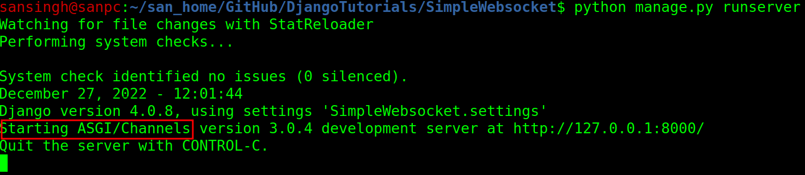
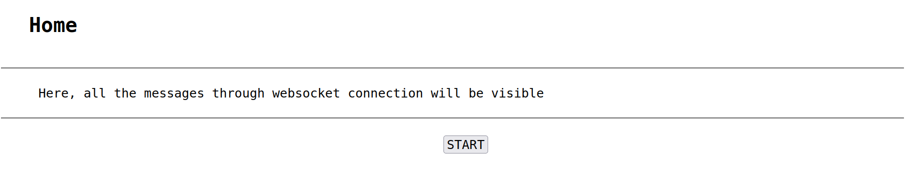
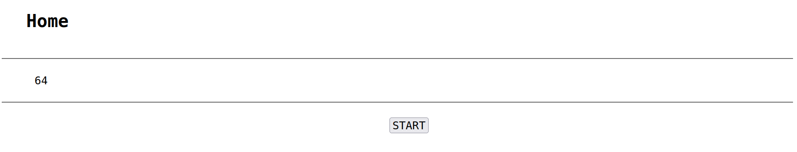

# SimpleWebsocket  
This is a simple Djanog project to demonstrate the working of WebSockets in Django.  
In this project, following is accomplished:  
1. On clicking a HTML button, the javascript function will connect with the backend (a Django function) through a web-socket  
2. This Django function will generate random numbers and send them at an interval of 1 second to the javascript function  
3. The same javascript function will display that randomly generated number on the HTML page  
  
## WebSocket  
HTTP (HyperText Transfer Protocol) and WebSocket, are the two communication protocols used in client-server communication.  
  
Following is how HTTP works:  
1. HTTP is uni-directional where the client sends the request and the server sends the response  
2. Here, a user (or client) sends a request to the server, this request goes in the form of HTTP or HTTPS, after receiving request, the server process it and then it sends the response to the user (or client)  
3. After sending the response, the connection gets closed  
4. Each HTTP or HTTPS establishes a new connection with the server every time and on getting the response from the server, the connection gets closed by itself  
5. HTTP or HTTPS is a stateless protocol that runs on top of TCP which is a connection-oriented protocol. It guarantees the delivery of data packets by using the three-way handshaking methods and re-transmits the lost packets  
6. HTTP can run on top of any reliable connection-oriented protocol such as TCP or SCTP. When a client sends a HTTP request to the server, a TCP connection is open between the client and server; and after getting response, the TCP connection gets terminated  
  
Following is how WebSocket works:  
1. WebSocket is a bi-directional and a full-duplex protocol that is used in the same scenario of client-server communication, unlike HTTP it starts from ws:// or wss://  
2. It is a stateful protocol, which means the connection between client and server will keep alive until it is terminated by either party, client or server  
3. When to use a web socket:  
   1. Real-time web application  
   2. Gaming application  
   3. Chat application  
  
## How to Build & Run this project?  
Following are the steps to build and run this project:  
1. Create a Django project:  
`$ django-admin startproject SimpleWebsocket`  
2. Navigate inside the project directory:  
`$ cd SimpleWebsocket`  
3. Migrate the initial changes:  
`$ python manage.py migrate`  
4. Create a new app:  
`$ python manage.py startapp HomeApp`  
5. Open the project "SimpleWebsocket" in PyCharm and create "template" and "static" directory inside "HomeApp"  
6. Create a file "home.html" inside "HomeApp/templates/" directory and put the following HTML code in it:  
```commandline
<!DOCTYPE html>
<html>
    <head>
        
        <link rel="stylesheet" href="">
        <script type="text/javascript" src=""></script>
        <title>Home</title>
    </head>
    <body>
        <h1>Home</h1>
        <br><hr><br>
        <div id="div_websocket">
            Here, all the messages through websocket connection will be visible
        </div>
        <br><hr><br>
        <button type="button" name="button_startCommunication" id="button_startCommunication" onclick="startCommunication()">START</button>
    </body>
</html>
```  
7. Create a file "home.css" in "HomeApp/static/" directory and put the following CSS code in it:  
```commandline
body {
    margin-left: 30px;
}

h1 {
    margin-left: 45px;
    font-family: monospace, monospace;
}

#div_websocket {
    margin-left: 60px;
    font-family: monospace, monospace;
    font-size: 20px;
}

#button_startCommunication {
    margin-left: 49%;
    font-family: monospace, monospace;
    font-size: 20px;
}
```  
8. Create a file "home.js" in "HomeApp/static/" directory and put the following code in it:  
```commandline
function startCommunication() {
    alert("I am working!");
}
```  
9. Install the "channels" python package. Make sure that the version of "channels" package is "3.0.4" if the version of Django is ">4.0.0":  
`$ sudo pip install channels==3.0.4`  
10. Open "SimpleWebsocket/SimpleWebsocket/settings.py", and add the name of app "HomeApp" & "channels" package in the INSTALLED_APPS variable, as shown below:  
```commandline
INSTALLED_APPS = [
    'django.contrib.admin',
    'django.contrib.auth',
    'django.contrib.contenttypes',
    'django.contrib.sessions',
    'django.contrib.messages',
    'django.contrib.staticfiles',
    'channels',
    'HomeApp',
]
```  
11. Scroll down in "SimpleWebsocket/SimpleWebsocket/settings.py" file until you see WSGI_APPLICATION variable. Copy this line and paste it in the next line; edit "WSGI" to "ASGI" in the new line, as shown below:  
```commandline
WSGI_APPLICATION = 'SimpleWebsocket.wsgi.application'
ASGI_APPLICATION = 'SimpleWebsocket.asgi.application'
```  
12. Now, run the following command:  
`$ python manage.py runserver`  
You should see something like below:  
  
13. Open "SimpleWebsocket/SimpleWebsocket/urls.py" and paste the following code:  
```commandline
from django.contrib import admin
from django.urls import path, include

urlpatterns = [
    path('admin/', admin.site.urls),
    path("", include("HomeApp.urls")),
]
```  
14. Open "SimpleWebsocket/HomeApp/views.py" and paste the following code:  
```commandline
from django.shortcuts import render

# Create your views here.
def homeView(request):
    return render(request, "home.html")
```  
15. Open "SimpleWebsocket/HomeApp/urls.py" and paste the following code:  
```commandline
from django.urls import path
from .views import homeView

urlpatterns = [
    path("", homeView, name="home page"),
]
```  
16. Create a file "consumers.py" inside "SimpleWebsocket/HomeApp/" and paste the following code:  
```commandline
from channels.generic.websocket import WebsocketConsumer
import json
from random import randint
import time

class WSConsumer(WebsocketConsumer):
    def connect(self):
        self.accept()
        for i in range(1000):
            message_dict = {
                'message': randint(0, 100),
            }
            json_message = json.dumps(message_dict)
            self.send(json_message)
            time.sleep(1)
```  
17. Create a file "routing.py" inside "SimpleWebsocket/HomeApp/" and paste the following code:  
```commandline
from django.urls import path
from .consumers import WSConsumer

ws_urlpatterns = [
    path('ws/some_url/', WSConsumer.as_asgi())
]
```  
18. Now, re-open "SimpleWebsocket/HomeApp/static/home.js" and paste the following code:  
```commandline
function startCommunication() {
    alert("Starting websocket communication");
    var socket = new WebSocket('ws://localhost:8000/ws/some_url/');
    socket.onmessage = function(event) {
        var data = JSON.parse(event.data);
        document.getElementById("div_ws").innerText = data.message;
    }
}
```  
19. Open "SimpleWebsocket/SimpleWebsocket/asgi.py" and paste the following code:  
```commandline
"""
ASGI config for realtime_pr project.

It exposes the ASGI callable as a module-level variable named ``application``.

For more information on this file, see
https://docs.djangoproject.com/en/4.0/howto/deployment/asgi/
"""

import os
from django.core.asgi import get_asgi_application
#websocket packages
from channels.routing import ProtocolTypeRouter
from channels.auth import AuthMiddlewareStack
from channels.routing import URLRouter
from HomeApp.routing import ws_urlpatterns

os.environ.setdefault('DJANGO_SETTINGS_MODULE', 'SimpleWebsocket.settings')

application = ProtocolTypeRouter({
    'http': get_asgi_application(),
    'websocket': AuthMiddlewareStack(URLRouter(ws_urlpatterns)),
})
```  
20. Now, navigate to the root of this project, i.e., "SimpleWebsocket/" and run the following command:  
`$ python manage.py runserver`  
Now, you should open http://localhost:8000/ in a browser and see the following:  
  
21. Now, click on the button "START" and you should see random numbers (in the range 0 to 100) printing on the webpage after an interval of 1 second:  
  