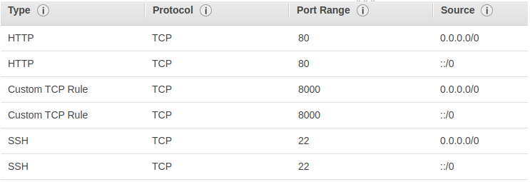

# CI/CD Pipeline  
This project is just to learn CI/CD (Continuous Integration/Continuous Delivery) by using GitHub Actions and AWS.  
  
Following are the technologies used in this project:  
1. Django  
2. uWSGI  
3. Nginx  
4. GitHub Actions (for CI/CD pipeline)  
5. AWS EFS (Elastic File System)  
6. AWS EC2  
This may further get extended by Docker and Kubernetes in future.  
  
## Deploying Django project on AWS EC2 instance (Simple Deployment - unprofessional and insecure)  
Here, we will deploy a Django project on a free AWS EC2 instance.  
For this follow the steps given below ([source](https://pythoncircle.com/post/697/hosting-django-app-for-free-on-amazon-aws-ec2-with-gunicorn-and-nginx/)):  
1. Create an AWS Elastic File System (EFS) and AWS Elastic Compute 2 (EC2) instance; and connect them. For the same, follow the following steps given on the [link](https://docs.aws.amazon.com/efs/latest/ug/gs-step-two-create-efs-resources.html):  
   1. Step 1: Create your file system  
   2. Step 2: Create EC2 resources and launch an instance  
2. Start your newly created instance from the AWS EC2 Dashboard.  
3. Connect with the running EC2 instance on SSH:  
   1. Note down the `Public DNS` of your EC2 instance for later use.  
   2. Add the following `inbound rules` to the `security group` of your EC2 instance on AWS:
     
   3. Run the following SSH command to connect with the instance:
   `$ ssh -i ./AWS/ci_cd-project.pem ubuntu@ec2-54-254-130-0.ap-southeast-1.compute.amazonaws.com`  
   4. Run `exit` command to exit the connection.  
4. After this, create a zip file of the Django project in this repository in the directory `DjangoProject`.  
5. Then, run the following SCP command on the local machine to copy this zip file from the local machine to the running EC2 instance:  
   `$ scp -i ./AWS/ci_cd-project.pem ./DjangoProject.zip ubuntu@ec2-54-254-130-0.ap-southeast-1.compute.amazonaws.com:~/.`  
6. Do SSH login and unzip the copied zip file by running the following commands:  
```commandline
$ ssh -i ./AWS/ci_cd-project.pem ubuntu@ec2-54-254-130-0.ap-southeast-1.compute.amazonaws.com
$ unzip DjangoProject.zip
```
7. Now, copy the public IP address of the running EC2 instance and put it in the `settings.py` file (on EC2 instance):  
```commandline
# run the following command to open settings.py file:
    $ cd DjangoProject
    $ vim DjangoProject/settings.py
# paste the public IP address of the EC2 instance in "ALLOWED_HOSTS" variable, as shown below:
    # SECURITY WARNING: don't run with debug turned on in production!
    DEBUG = True
    
    ALLOWED_HOSTS = ["54.254.130.0"]
    
    # Application definition
    
    INSTALLED_APPS = [
        'django.contrib.admin',
        'django.contrib.auth',
        'django.contrib.contenttypes',
        'django.contrib.sessions',
        'django.contrib.messages',
        'django.contrib.staticfiles',
        'HomeApp',
    ]
```  
8. Finally, run the following command on EC2 instance:  
`$ python3 manage.py runserver 0.0.0.0:8000`  
9. Now, hit the `<public_IP_address>:8000` in your browser. The application should work there.  
10. ++  
  
This is an unprofessional and extremely unsafe method of deploying a Django app on AWS EC2 instance. This is because we are using the default Django server on EC2 instance. This server is only for development and debugging purpose. It is not at all for production purpose as it lacks a lot of features that are "must" at production level (including security).  
  
## Deploying Django project on AWS EC2 instance (professional deployment - without docker and CI/CD)  
Follow the below steps to deploy your Django project on AWS EC2 instance ([source](https://uwsgi-docs.readthedocs.io/en/latest/tutorials/Django_and_nginx.html)):  
1. Assuming that AWS EFS and AWS EC2 instances are created and its key is stored at a safe place. If not, then please follow the steps given in the above section, i.e., "Deploying Django project on AWS EC2 instance (Simple Deployment - unprofessional and insecure)".  
2. Develop your Django project on your local machine. Assume the name of Django project is "HelloDjango". Create its zip file "HelloDjango.zip".  
3. Start your EC2 instance, copy and save the following in a file for later use:  
   1. Public IP addressn of the running EC2 instance: 54.255.238.233 (assume)  
   2. Public IPv4 DNS: ec2-54-255-238-233.ap-southeast-1.compute.amazonaws.com (assume)  
4. Copy the zip file of your Django project on the running EC2 instance by firing the following scp command (note that "ubuntu" is the username and the string after "@" symbol is the public IPv4 DNS of the running EC2 intance):  
```
scp -i /path/to/AWS/key/ci_cd-project.pem ./HelloDjango.zip ubuntu@ec2-54-255-238-233.ap-southeast-1.compute.amazonaws.com:~/
```  
5. Do SSH login on your running EC2 instance from your local machine. Open terminal on your local machine and run the following:  
```
$ ssh -i /path/to/AWS/key/ci_cd-project.pem ubuntu@ec2-54-255-238-233.ap-southeast-1.compute.amazonaws.com
```  
6. Now, you have successfully logged-in in the running EC2 instance. Unzip the project by running the following command (note the output of `pwd` command):  
```
$ unzip HelloDjango.zip
$ cd HelloDjango
$ pwd
```  
7. Install nginx by running the following command:  
```
$ sudo apt-get install nginx
```  
8. Now, create a virtual environment with name "venv" and install some packages by running the following commands:  
```
$ pip3 install --upgrade pip
$ pip3 install venv
$ python3 -m venv venv
$ source ./venv/bin/activate
(venv) $ pip3 install --upgrade pip
(venv) $ pip3 install Django
(venv) $ pip3 install uwsgi
```  
9. Create a file "uwsgi_params" and copy the below text as it is:  
```
uwsgi_param  QUERY_STRING       $query_string;
uwsgi_param  REQUEST_METHOD     $request_method;
uwsgi_param  CONTENT_TYPE       $content_type;
uwsgi_param  CONTENT_LENGTH     $content_length;

uwsgi_param  REQUEST_URI        $request_uri;
uwsgi_param  PATH_INFO          $document_uri;
uwsgi_param  DOCUMENT_ROOT      $document_root;
uwsgi_param  SERVER_PROTOCOL    $server_protocol;
uwsgi_param  REQUEST_SCHEME     $scheme;
uwsgi_param  HTTPS              $https if_not_empty;

uwsgi_param  REMOTE_ADDR        $remote_addr;
uwsgi_param  REMOTE_PORT        $remote_port;
uwsgi_param  SERVER_PORT        $server_port;
uwsgi_param  SERVER_NAME        $server_name;
```  
10. Make sure that there is no file in the path `/etc/nginx/sites-enabled/`. If there is anything, then simply delete it by running the following command:  
```
$ sudo rm -r /etc/nginx/sites-enabled/*
```  
11. Create a file `/etc/nginx/sites-available/HelloDjango_nginx.conf` and paste the following content in it (update the path of project - replace `/home/ubuntu/HelloDjango` with your project path, and update the public IP address of the running EC2 instance against `server_name`):  
```
# HelloDjango_nginx.conf

# the upstream component nginx needs to connect to
upstream django {
    server unix:///home/ubuntu/HelloDjango/HelloDjango.sock; # for a file socket
    #server 54.254.95.165:8001; # for a web port socket (we'll use this first)
}

# configuration of the server
server {
    # the port your site will be served on
    listen      8000;
    # the domain name it will serve for
    server_name 54.254.95.165; # substitute your machine's IP address or FQDN
    charset     utf-8;

    # max upload size
    client_max_body_size 75M;   # adjust to taste

    # Django media
    location /media  {
        alias /home/ubuntu/HelloDjango/media;  # your Django project's media files - amend as required
    }

    location /static {
        alias /home/ubuntu/HelloDjango/static; # your Django project's static files - amend as required
    }

    # Finally, send all non-media requests to the Django server.
    location / {
        uwsgi_pass  django;
        include     /home/ubuntu/HelloDjango/uwsgi_params; # the uwsgi_params file you installed
    }
}
```  
12. Link the above file by running the following command (make sure nginx's status is `active (running)` after the `status` command):  
```
$ sudo ln -s /etc/nginx/sites-available/HelloDjango_nginx.conf /etc/nginx/sites-enabled/
```  
13. On EC2, generally the default username is "ubuntu". Verify it in your terminal. It will be before "@" symbol on your terminal. Assuming the username is "ubuntu", update the user name in the first line of `/etc/nginx/nginx.conf` file. After update, the first line of this file will look like this:  
```
user ubuntu;
```  
14. Restart the nginx:  
```
$ sudo systemctl restart nginx
$ sudo systemctl status nginx
```  
15. Open `./HelloDjango/settings.py` file and add the line 14, 27 (make it False), 29 (add the public IP address of the running EC2 instance), and 31:  
```
1.  """
2.  Django settings for HelloDjango project.
3.  
4.  Generated by 'django-admin startproject' using Django 4.1.6.
5.  
6.  For more information on this file, see
7.  https://docs.djangoproject.com/en/4.1/topics/settings/
8.  
9.  For the full list of settings and their values, see
10. https://docs.djangoproject.com/en/4.1/ref/settings/
11. """
12. 
13. from pathlib import Path
14. import os
15. 
16. # Build paths inside the project like this: BASE_DIR / 'subdir'.
17. BASE_DIR = Path(__file__).resolve().parent.parent
18. 
19. 
20. # Quick-start development settings - unsuitable for production
21. # See https://docs.djangoproject.com/en/4.1/howto/deployment/checklist/
22. 
23. # SECURITY WARNING: keep the secret key used in production secret!
24. SECRET_KEY = 'django-insecure-17r!3vxy0aush=*9k!66najm$2!k%0@t=3hb8sdf6a%x(*!t^-'
25. 
26. # SECURITY WARNING: don't run with debug turned on in production!
27. DEBUG = False
28. 
29. ALLOWED_HOSTS = ["54.255.238.233"]
30. 
31. STATIC_ROOT = os.path.join(BASE_DIR, "static/")
32. 
33. 
34. # Application definition
35. 
36. INSTALLED_APPS = [
37.     'django.contrib.admin',
38.     'django.contrib.auth',
39.     'django.contrib.contenttypes',
40.     'django.contrib.sessions',
41.     'django.contrib.messages',
42.     'django.contrib.staticfiles',
43.     'HomeApp',
44. ]
```  
16. Create a file `./HelloDjango_uwsgi.ini` and paste the following content (replace the path `/home/ubuntu/DjangoProject` with the path of your project):  
```
[uwsgi]

# Django-related settings
# the base directory (full path)
chdir           = /home/ubuntu/HelloDjango
# Django's wsgi file
module          = HelloDjango.wsgi
# the virtualenv (full path)
home            = /home/ubuntu/HelloDjango/venv

# process-related settings
# master
master          = true
# maximum number of worker processes
processes       = 10
# the socket (use the full path to be safe
socket          = /home/ubuntu/HelloDjango/HelloDjango.sock
# ... with appropriate permissions - may be needed
chmod-socket    = 664
# clear environment on exit
vacuum          = true
```  
17. Run the following commands:  
```
$ python3 manage.py makemigrations
$ python3 manage.py migrate
$ python3 manage.py collectstatic

$ sudo systemctl restart nginx
$ sudo systemctl status nginx
```  
18. Finally, run the following command:  
```
$ uwsgi --ini HelloDjango_uwsgi.ini
```  
19. Now, hit the url `<public IP address of the EC2 instance>:8000`, you Django site should be up there.  